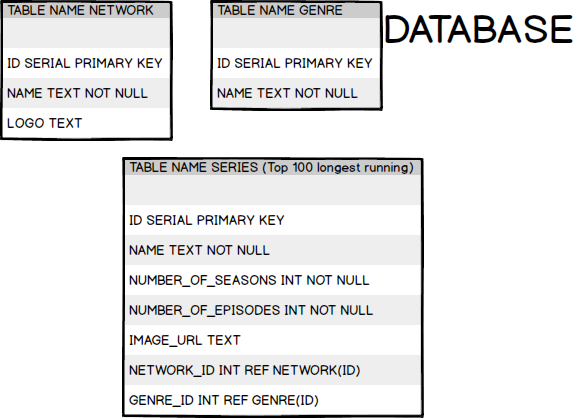
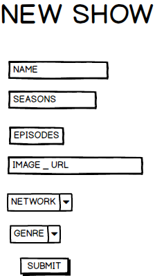
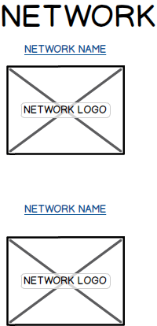
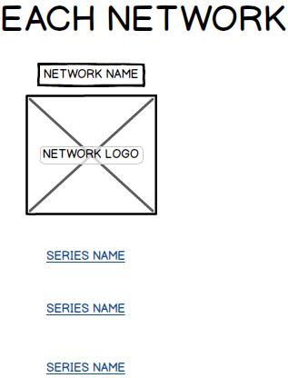
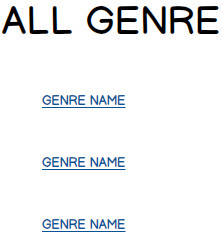
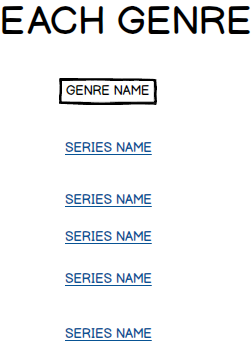
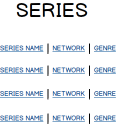
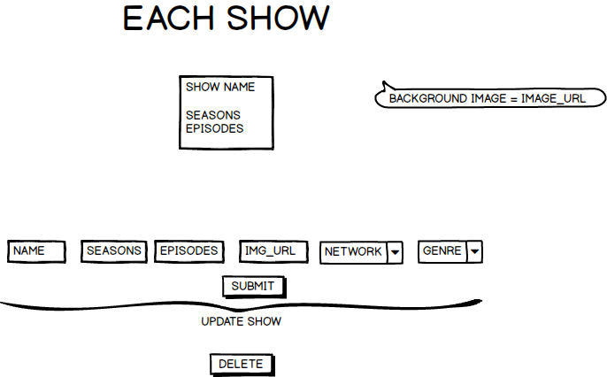
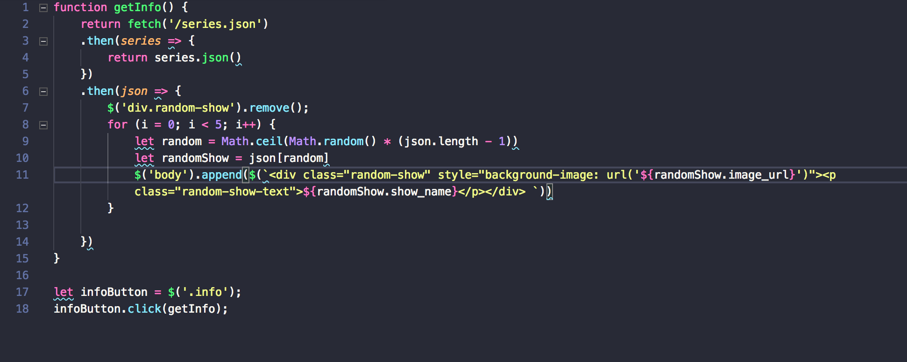
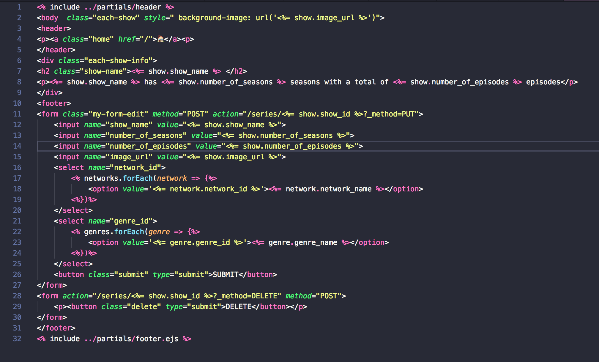

# PRIMETIME-SERIES

## DESCRIPTION
This CRUD APP takes the list of the longest running American primetime series and lists them.  You can search the series by network, genre, or just look at the entire list of shows.  You can also add a show, network or genre, but you cannot delete a network or genre that is being references by a show.

## USER STORIES
- I want to see all the longest running TV shows
- I want to see each TV show and show the info about that TV show to a friend
- I want to add my favorite TV show
- I want to modify a TV show in case it has some wrong infomation, or it has been added for an additional season
- I want to delete a TV show in case it is a dulplicate of an already listed TV show

## WIREFRAMES
### **DATABASE**

### **HOMEPAGE**

### **CREATE SHOW**

### **NETWORK HOME PAGE**

### **EACH NETWORK PAGE**

### **GENRE HOME PAGE**

### **EACH GENRE PAGE**

### **SERIES HOME PAGE**

### **EACH SERIES PAGE**

## TECH USED
- **bluebird:**  Promise Library
- **body_parser:** Parses incoming body requests
- **ejs:** Templating language that generates HTML
- **express:** Web application framework (node.js)
- **method_override:** Middleware for put and delete(Overrides Post or Get methods)
- **pg-monitor:** Event monitor for pg-promise, simplifiest events logging
- **pg-promise:** Promise Library for PostgresSQL
- **jquery:** Javascript library that make it easier to traverse the DOM

## CODE SNIPPET

### CODE FOR RANDOMLY GENERATED TV SHOW USING FETCH

### CODE FOR EACH SHOW WITH CHANGING BACKGROUND

## THINGS I WOULD LIKE TO ADD
- An API that dynamically changes the table
- No repeating shows randomly generated
- Plot and characters to each series page

## INSTALLATION INSTRUCTIONS
- FORK repo
- CLONE repo onto local machine
- npm init
- npm install

## RUN LOCALHOST
- node serve\r.js
### OR
- npm install --save nodemon
- nodemon server.js

*Link to Video Description:* https://www.youtube.com/watch?v=fzuXH5EWEmE&feature=youtu.be